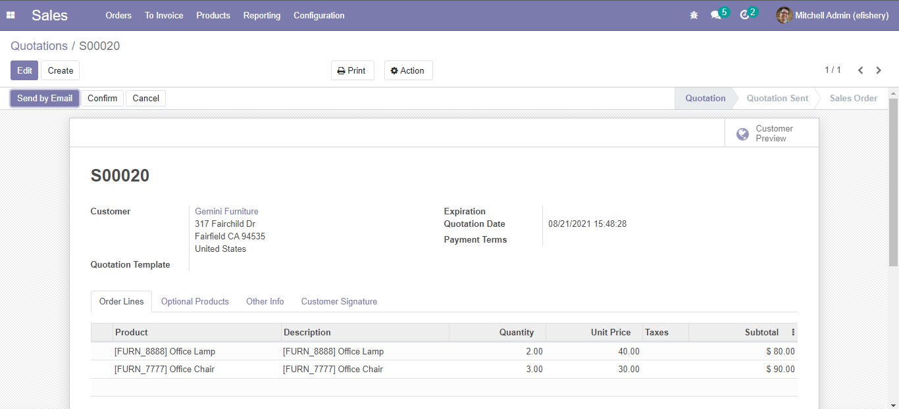

## Integration Project

> Description Project

[](https://forthebadge.com)

### Prerequisites

- Docker (Developed with version 20.10.7)

### Installation

Run an docker-compose file by copying the given example.

```
$ docker-compose up -d
```

## Developer Guide

### Service Testing

Docker will build & run three services, there are db-service, odoo-service, interceptor service. Use terminal to check if this service was running by given example.
```
$ docker ps
```
It will look like this if all services are running well
<p align="center"></p>

Service log can be access by following command bellow. Just change container name if developer want to check another service log
```
$ docker logs -f -n 200 odoo-service
```
Below is an picture example of the service log
<p align="center"></p>

Developer can user browser to access root endpoint from odoo-service & interceptor-service, here are the URL and port of each service

* Odoo Service - *host : localhost - port : 9000*
<p align="center"></p>

* Interceptor Service - *host : localhost - port :8000*
<p align="center"></p>

### API Testing

There are three http methods ( *POST, GET, PUT* ) that can be tested by developer
For full documentation, developer can see odoo-openapi.yml file. Below is an example API testing to generate quotation in Odoo. Author use postman for sending request to interceptor-service ( *Dispatcher service between client & Odoo* )

<p align="center"></p>


Result of this request, visit to Odoo login page ( *user : admin ,pass : admin* ) then move to Sales menu & filter based on *Source Document*

<p align="center"></p>

Generate quotation action will trigger Odoo for publish event action to webhook, the message will appear on interceptor-service log

<p align="center"></p>


## Author

* **Pamungkas Jati**
